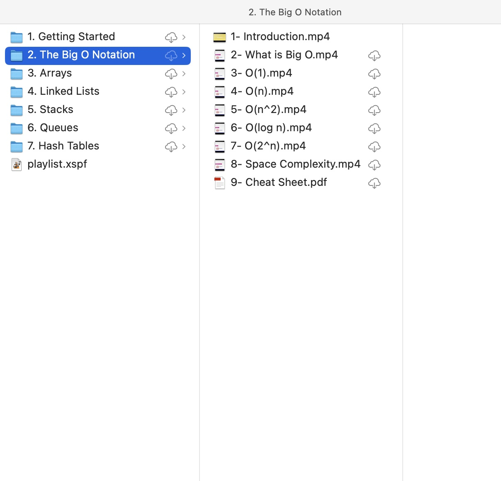
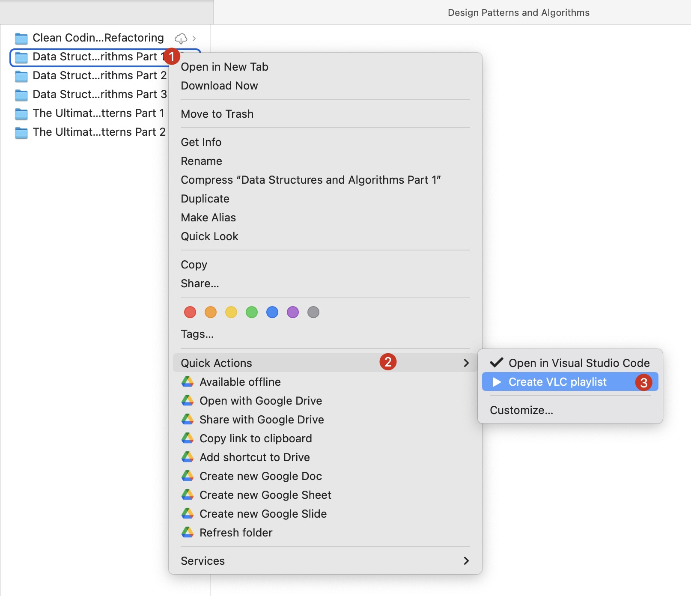
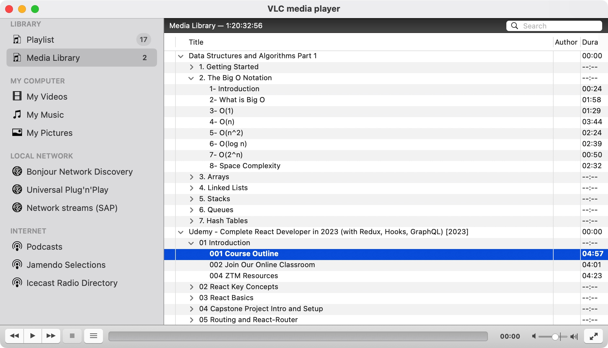
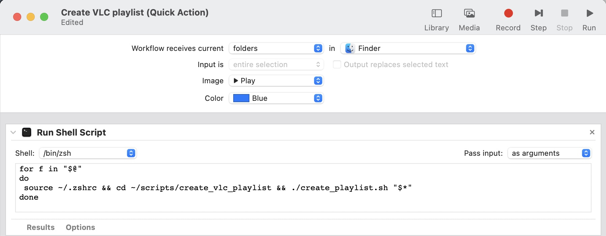

# What is it?

When I download online courses from the internet, the courses often don't have playlists, so it's really difficult for me to navigate the video content in the courses. This tool helps me create playlists and group videos by course section.





## Environment

```ruby
OS: macOS Ventura (13.3.1)
Ruby: 3.2.1
RVM: 1.29.12
NVM: 0.39.3
```

## Setup

1. Clone scripts to local machine

    ```bash
    git clone git@github.com:dhhiep/scripts.git ~/scripts
    chmod +x ~/scripts/create_vlc_playlist/create_playlist.sh

    # Install gem dependencies
    gem install 'builder'
    ```

2. Add script to right menu context

    

   + Open Automator
   + File -> New -> Quick Action
   + Change "Workflow Receives current" to "folders" in "Finder"
   + Add a "Run Shell Script" action
   + Change "Pass input" to "as arguments"
   + Paste the following in the shell script box

     ```bash
     for f in "$@"
     do
       source ~/.zshrc && cd ~/scripts/create_vlc_playlist && ./create_playlist.sh "$*"
     done
     ```

   + Save it as something like "Create VLC Playlist"

3. Granting full disk access to Finder

   + Go to System Preferences > Privacy & Security > Full Disk Access
   + Click to plus sign to add Finder (path `/System/Library/CoreServices/Finder.app`)
   + Click `Quit and Open` at alert popup

4. Generate playlist for online course
   + Right click on course folder `Quick Actions > Create VLC Playlist`
   + Open `playlist.xspf` with VLC application

## References

+ [Mac OS X: Open in Visual Studio Code](https://gist.github.com/tonysneed/f9f09bfa28bcf98e8d8306f9b21f99e2?permalink_comment_id=3117692)
+ [How to Fix Automator's "Operation Not Permitted" Error in macOS Catalina](https://brianli.com/how-to-fix-automator-operation-not-permitted-error-in-macos-catalina/)
